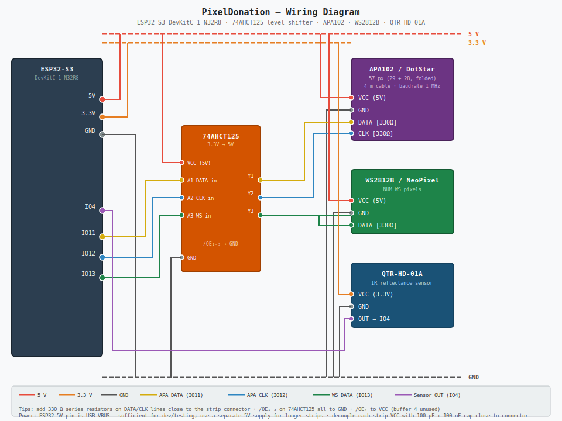

# PixelDonation

Circuitpython firmware for pixel-donation devices: a donation box with a sensor - every time something is thrown in, the pixel-strip gives a _thanks_ animation.

## HW

[ESP32-S3-DevKitC-1-N32R8](https://docs.espressif.com/projects/esp-dev-kits/en/latest/esp32s3/esp32-s3-devkitc-1/user_guide_v1.0.html)

-   [circuitpython](https://circuitpython.org/board/espressif_esp32s3_devkitc_1_n32r8/)
-   [pin layout](https://docs.espressif.com/projects/esp-dev-kits/en/latest/esp32s3/_images/ESP32-S3_DevKitC-1_pinlayout.jpg)

### Sensor

[Pololu QTR-HD-01A Reflectance Sensor](https://www.pololu.com/product/4091) — single IR reflectance sensor with analog output.

| Sensor pin | ESP32-S3 GPIO | CircuitPython | Notes                             |
| ---------- | ------------- | ------------- | --------------------------------- |
| OUT        | GPIO4         | `board.IO4`   | ADC1 — reliable, no WiFi conflict |
| VCC        | 3.3 V         | —             |                                   |
| GND        | GND           | —             |                                   |

### Pixel strips

#### APA102 / DotStar (primary strip)

57 pixels total (29 + 28), physically folded at pixel 29. Treated as a single linear strip for now.

| Signal      | ESP32-S3 GPIO | CircuitPython |
| ----------- | ------------- | ------------- |
| DATA (MOSI) | GPIO11        | `board.IO11`  |
| CLK         | GPIO12        | `board.IO12`  |

Uses hardware SPI2 (`busio.SPI`). Requires `adafruit_dotstar` in `lib/`.

#### WS2812B / NeoPixel (secondary strip)

| Signal | ESP32-S3 GPIO | CircuitPython |
| ------ | ------------- | ------------- |
| DATA   | GPIO13        | `board.IO13`  |

Uses the built-in `neopixel` module. Strip length configured via `NUM_WS` in `main.py`.

### Pin constraints on N32R8

Pins **not** available for general I/O on this variant:

| Range                        | Reason                        |
| ---------------------------- | ----------------------------- |
| GPIO19, GPIO20               | USB D−/D+ (CircuitPython CDC) |
| GPIO26–32                    | OPI PSRAM (8 MB)              |
| GPIO33–37                    | OPI Flash (32 MB)             |
| GPIO0, GPIO3, GPIO45, GPIO46 | Strapping pins                |

## License

<!-- license info -->

 

    all files (if not noted otherwise) in PixelDonation repository
 by
<a
    xmlns:cc="http://creativecommons.org/ns#"
    href="https://github.com/s-light/magic_lantern"
    property="cc:attributionName"
    rel="cc:attributionURL">
    Stefan Krüger (s-light)
</a>
are licensed under a 
<a rel="license" href="http://creativecommons.org/licenses/by/4.0/">
    Creative Commons Attribution 4.0 International License
</a>.

all software parts/files are licensed under [MIT](LICENSE).
